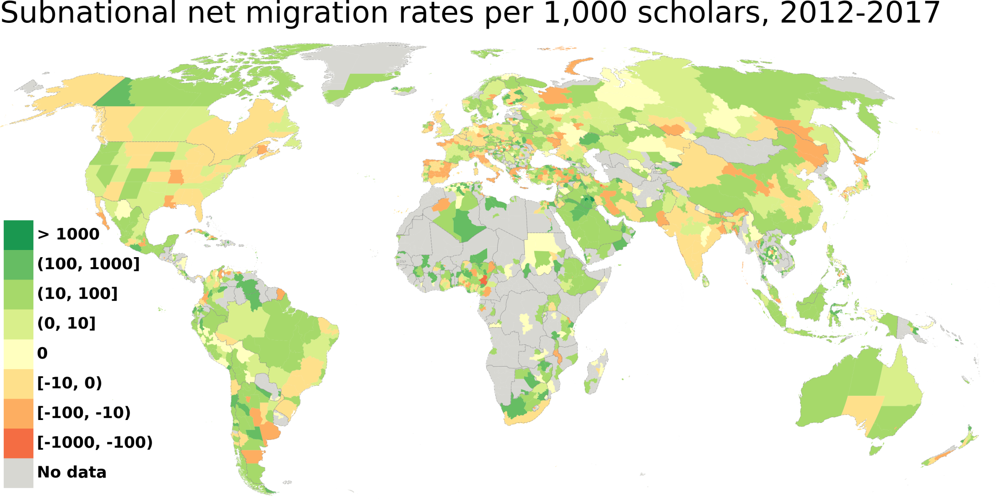
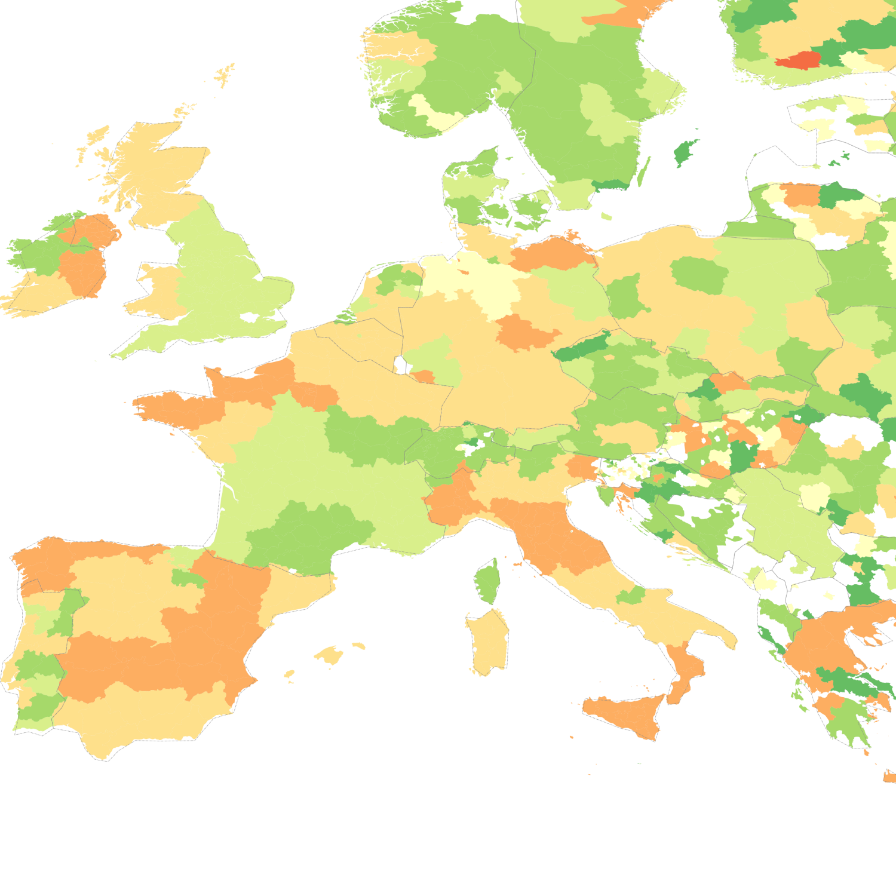
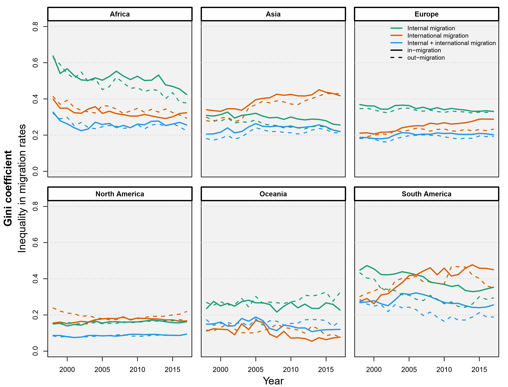
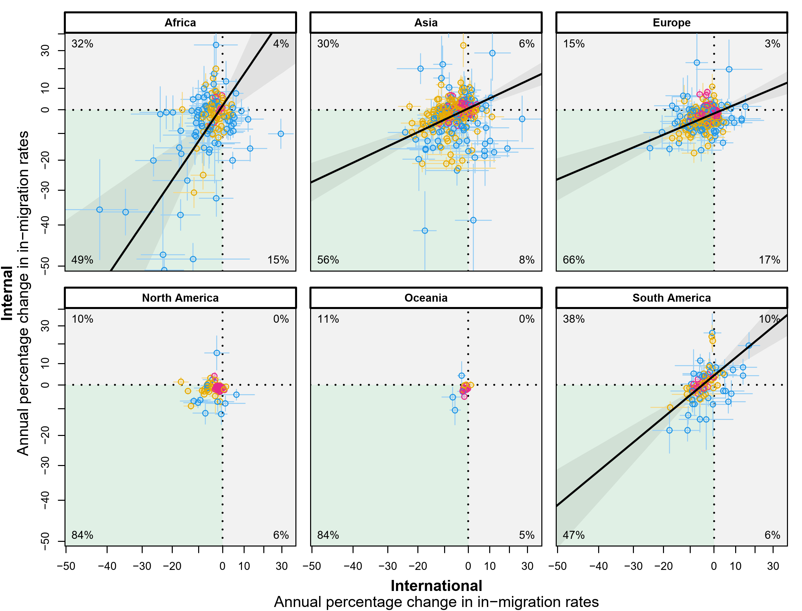
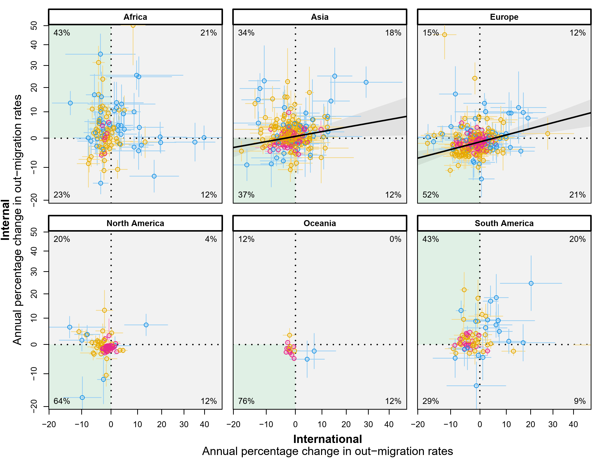
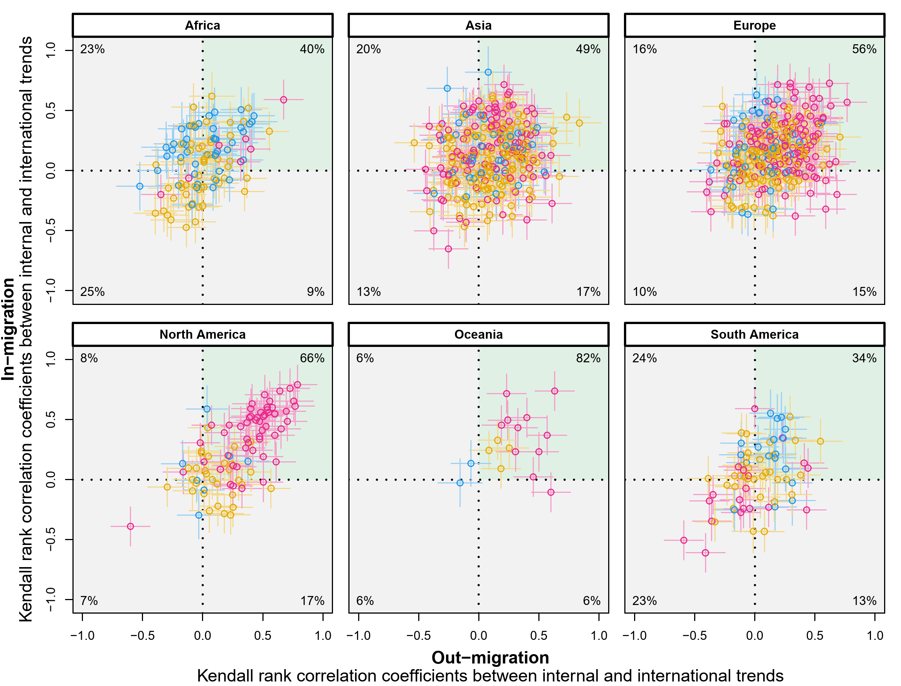

# Scripts, data, and replication materials for "Global subnational estimates of migration of scientists reveal large disparities in internal and international flows"

This repository includes replication materials including data, Python and R scripts to replicate the analysis and figures (shown further below) of the article with following metadata.

**Script authors/maintainers**: [Aliakbar Akbaritabar](https://github.com/akbaritabar), [Maciej J. Dańko](https://github.com/MaciejDanko)

**Contact**: akbaritabar@demogr.mpg.de; danko@demogr.mpg.de

**Article title**: Global subnational estimates of migration of scientists reveal large disparities in internal and international flows

**Manuscript authors**: Aliakbar Akbaritabar, Maciej J. Dańko, Xinyi Zhao, Emilio Zagheni

**Article DOI**: TO-ADD-xxxxxxxxxxx-yyyyyyyyy

**Abstract**:
Researchers are key contributors to innovation. Their migration results in talent circulation and recombination of ideas. Due to data shortage, little is known about subnational mobility of scientists and the interrelationships between their internal and international migration patterns. We used data on 30+ million Scopus publications of 19+ million authors to infer migration from changes in affiliations. Our publicly shared database of global subnational estimates of migration reveals relevant disparities in the attractiveness of subnational regions. While, at the country level, some countries have acted as a global hub that attracts scholars from throughout the world, at the subnational level, some of their regions have negative net migration rates, with implications for scientific output and regional development, as well as the perpetuation of migration corridors. On average, subnational inequalities in attracting and sending scholars have increased for international but decreased for internal migration. In most countries, there is no single trend such that all subnational regions have been sending or receiving more scholars. Instead, a mix of patterns has been simultaneously at work, on the backdrop of globalization of migration, which is an asymmetric process where specific regions and sub-populations have higher access to international migration. For most subnational regions, when they are attractive for international migrants, they are also attractive for internal migrants, which is not always the case for emigration. Our results have implications for the global circulation of academic talent by adding the dimension of internal migration to ‘brain drain’ and ‘brain circulation’ in international migration.


## How to replicate the analysis

Our repository and replication materials include two parts. 

First is preparing the main data for subnational migration. This includes scripts, data, and the reproducible pipeline that creates final data for our manuscript. This includes the preparation of migration data and measures, visualizations for subnational maps (figure 1 in the manuscript, see it further below, and multiple figures in the SI disaggregated by field of science, academic age, and cumulative number of publications, see them under `results` folder). These scripts are developed in Python and the reproducible workflow (described below) uses SnakeMake workflow management to ensure full replicability. 

The second part includes R scripts for statistical analysis and figures 2-4 in the manuscript (see them further below) and multiple figures in the SI (see them under `results` folder).

Below, we describe the requirements for each of these.

## Python requirements

These scripts are written by [Aliakbar Akbaritabar](https://github.com/akbaritabar).

For the reproducible pipeline to recreate the paper's replication data and migration measures, you need to have [SnakeMake](https://snakemake.readthedocs.io/en/stable/index.html) version 8 or above installed. Creating a conda environment with Python 3 (3.11.9 was used here) and the following libraries (for instance by running `conda env create -f requirements.yml` and after copying the following yml code into a file: "requirements.yml") enables reproducing the pipeline by opening CLI, activating the conda environment i.e., `conda activate subnational`, and running a dry-run with `snakemake -np all` or a full reproduction with `snakemake --cores 4 all`.

An HTML report shows the a directed acyclic graph (DAG) of the dependency of the steps in the pipeline (rules in SnakeMake lingua). Please note that some of these rules require Scopus data at the individual level which is licensed and we cannot share them publicly. Hence, these output files are commented out from the main Snakefile and rule all. However, the aggregated data to prepare the migration measures at the subnational level and recreate all our figures and statistical analysis are included in this repository which completely complies with the license terms of the data provider. 

```yml
name: subnational
channels:
  - conda-forge
  - bioconda
  # to prevent using default anaconda channels
  - nodefaults
dependencies:
- python 3.*
- os
- pandas
- plotnine
- argparse
- geopandas
- numpy
- logging
- mizani # (is installed with plotnine)
- duckdb
- tabulate
- pip:
  - pycountry_convert # (from Pypi, if gives error, comment out and after installation run "pip install pycountry_convert" in CLI)

```


## R packages

These R scripts for statistical analysis are written by [Maciej J. Dańko](https://github.com/MaciejDanko).

To replicate the statistical analysis, following packages should be installed. The scripts and the data used in them are in the folder `workflow\scripts\Danko\`. Please note, due to GitHub's 100MB limit on file sizes, only some of the example results from statistical models are included. Using the data provided and the scripts, all of these files could be replicated.

```R

required_packages <- c("brms", "data.table", "deming", "DescTools", "dplyr", "Kendall", "lava", "magicaxis", "mgcv", "openxlsx", "parallel", "purrr", "splines", "stats")

missing_packages <- required_packages[!(required_packages %in% installed.packages()[, "Package"])]

if (length(missing_packages) > 0) {
  install.packages(missing_packages)
}

z<-lapply(required_packages, require, character.only = TRUE)
rm(z)


```

# Publication figures

## Figure 1: Subnational net migration rates (NMRs) per 1,000 scholars (using GeoNames admin-1), worldwide (top) and for Europe (bottom).





## Figure 2: Year-specific, region-based weighted Gini coefficients across continents and six types of migration.



## Figure 3: Slopes of quasi-Poisson regressions for migration rate trends over time for in-migration (top) and out-migration (bottom) in each region. 





## Figure 4: Kendall rank correlation coefficients between internal and international (1998-2017) for in-migration (Y-axis) and out-migration (X-axis)

